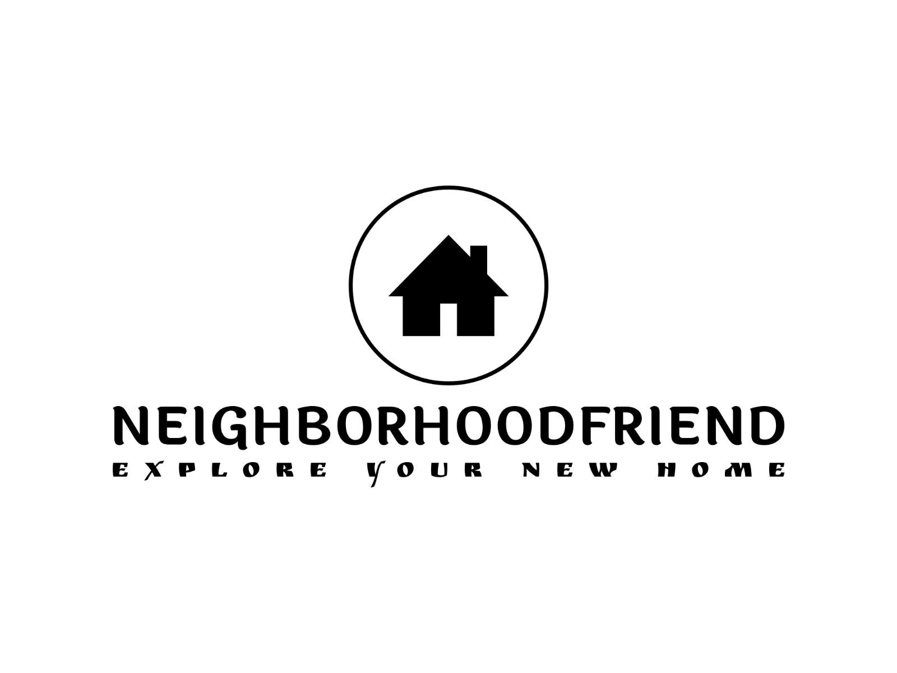
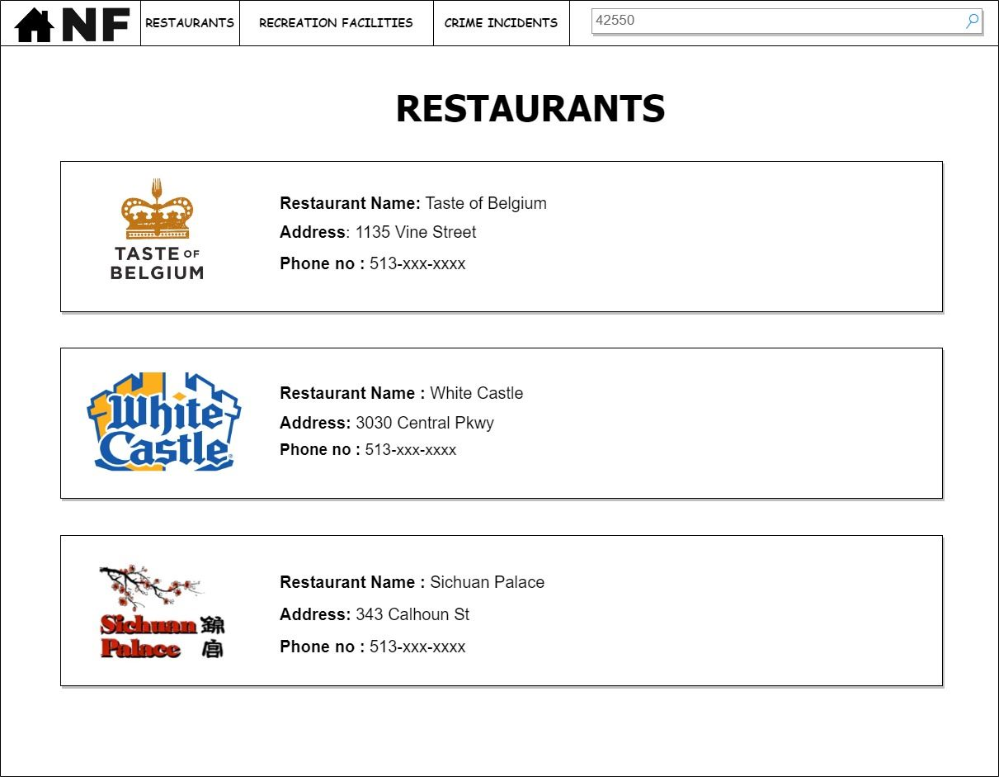
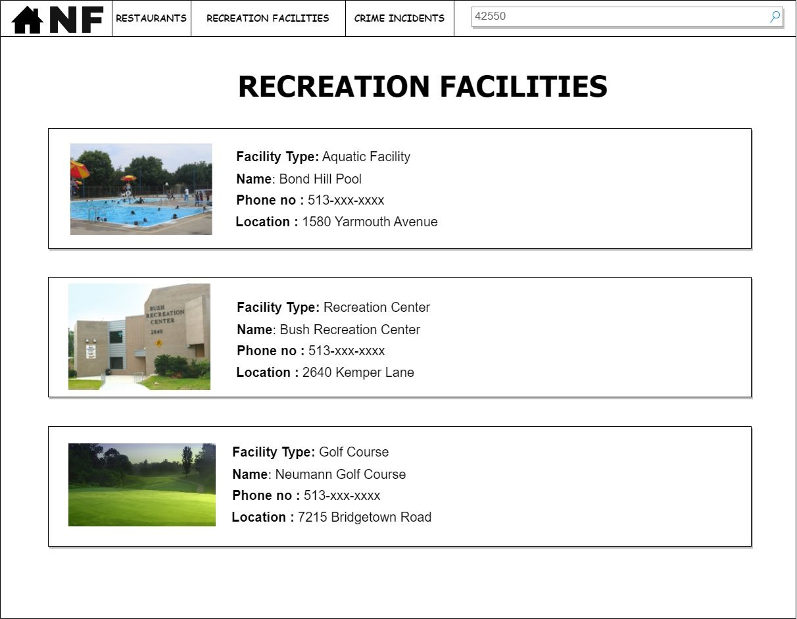

# NeighborhoodFriend

## Logo

## **Introduction**

Moving to a new place and excited to know all about your new neighborhood? Our NeighborhoodFriend is here to ease this process for you. With the help of our website, you will be able to – 
*	View all the restaurants available in your neighborhood
*	View all the recreation facilities available near your neighborhood
*	Check the crime rate in your neighborhood

## **Story Board**

## **Data Sources**

*	[Data Source for Restaurants](https://data.cincinnati-oh.gov/resource/rg6p-b3h3.json)
*	[Data Source for Recreation Facilities](https://data.cincinnati-oh.gov/resource/vset-45gc.json)
*	[Data Source for Crime Incident Reports](https://data.cincinnati-oh.gov/resource/k59e-2pvf.json)

## **Assumptions**

*	The user is aware of their desired neighborhood’s zip code or address
*	The user is comfortable using English as their primary language

## **Dependencies**

*	The Cincinnati Food Safety Program data is available 
*	The Cincinnati Recreation Commission Facility Listing data is available 
*	The PDI (Police Data Initiative) Crime Incidents data is available

## **Functional Requirements**

### **Requirement 1.0: Search for restaurants available in neighborhood**

### **Scenario**

As a user interested in moving to a new neighborhood, I want to find the list of restaurants present in my neighborhood so that I can learn more about the options available for eating out.

### **Examples**

## 1.1 
**Given** a feed of restaurant data is available  
**When** I search for "Postal Code"  
**Then** I should receive a list of all the restaurants listed under that postal code:  

1.	Business Name:  
    Address:   
    Phone Number:  

2.	Business Name:  
    Address:  
    Phone Number:  

## 1.2 
**Given** a feed of restaurant data is available  
**When** I search for "Street Name"  
**Then** I should receive a list of all the restaurants listed with that street name:  

1.	Business Name:  
    Address:   
    Postal Code:  
    Phone Number:  

2.	Business Name:  
    Address:  
    Postal Code:  
    Phone Number:  

### **Requirement 2.0: Search for recreation facilities available in neighborhood**

### **Scenario**

As a user interested in moving to a new neighborhood, I want to be aware of all the recreation facilities available for my use around my neighborhood so that I can plan my weekend activities.

### **Examples**

## 2.1 
**Given** a feed of recreation facilities data is available  
**When** I search for "Zip Code"  
**Then** I should receive a list of all the recreation facilities available in that zip code:  

1.	Facility Type:  
    Name:  
    Location:  
    Phone:  

2.	Facility Type:  
    Name:  
    Location:  
    Phone:  

## 2.2 
**Given** a feed of recreation facilities data is available  
**When** I search for "Facility Type"  
**Then** I should receive a list of all the recreation facilities for that type:  

1.	Name:  
    Location:   
    Zip Code:  
    Phone:  

2.	Facility Type:  
    Location:  
    Zip Code:  
    Phone:  

### **Requirement 3.0: Check the crime rate in the neighborhood**

### **Scenario**

As a user interested in moving to a new neighborhood, I want to know the crime rate in the neighborhood based on various attributes (ex: zip code, type of offense) so that I can educate myself on the safety situation.

### **Examples**

## 3.1 
**Given** a feed of crime incident reports is available  
**When** I search for "Zip Code"  
**Then** I should receive the number of incidents reported in that neighborhood:  
  
Number of Incidents Reported:  
  
## 3.2 
**Given** a feed of crime incident reports is available  
**When** I search for "Type of Offense"  
**Then** I should receive the number of incidents reported in that neighborhood:  
  
Number of Incidents Reported:  
  
## **Team Members**

- Scrum Master: Praneeth Munukutla	
- Product Owner: Samipya Pamuru
- Frontend Developer: Jahnavi Galla and Samipya Pamuru
- Backend Developer: Avi Aggarwal
- Integration Developer: Pavan Preetam Motagi

## **Weekly Meeting**

Tuesdays at 10 AM in person.
